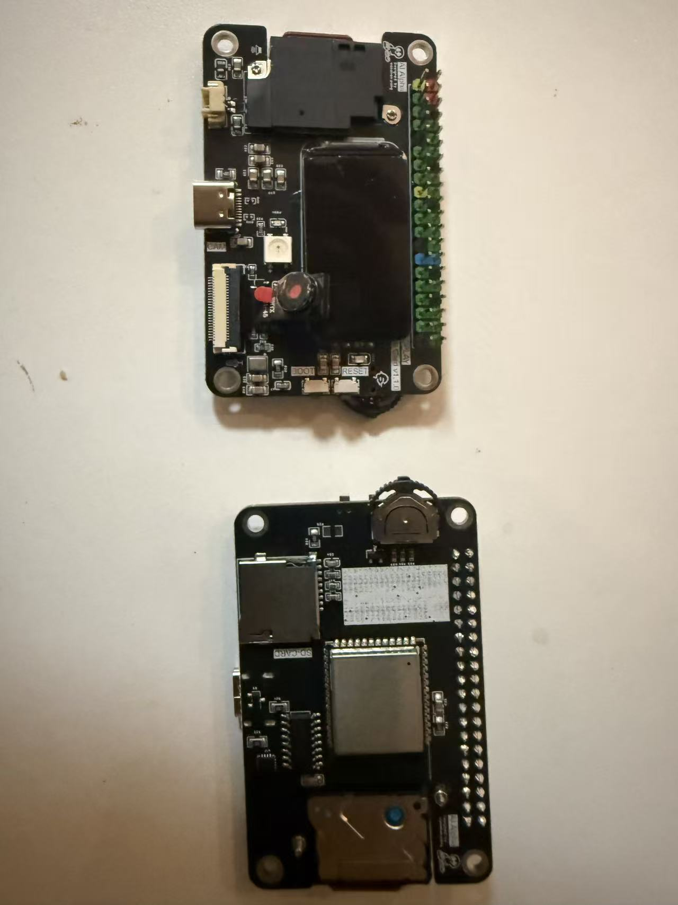
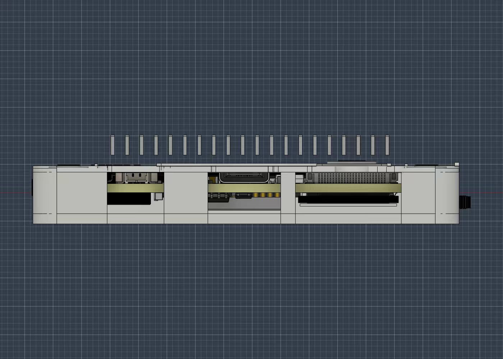
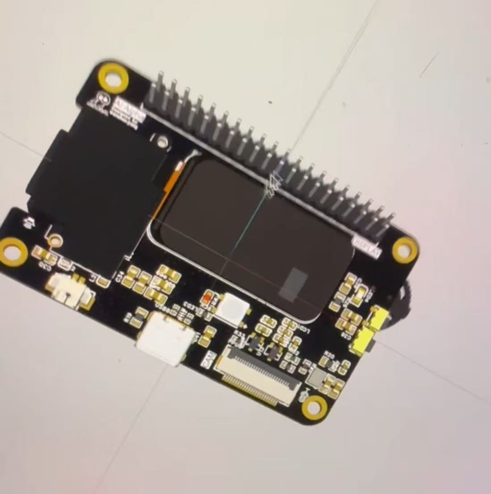
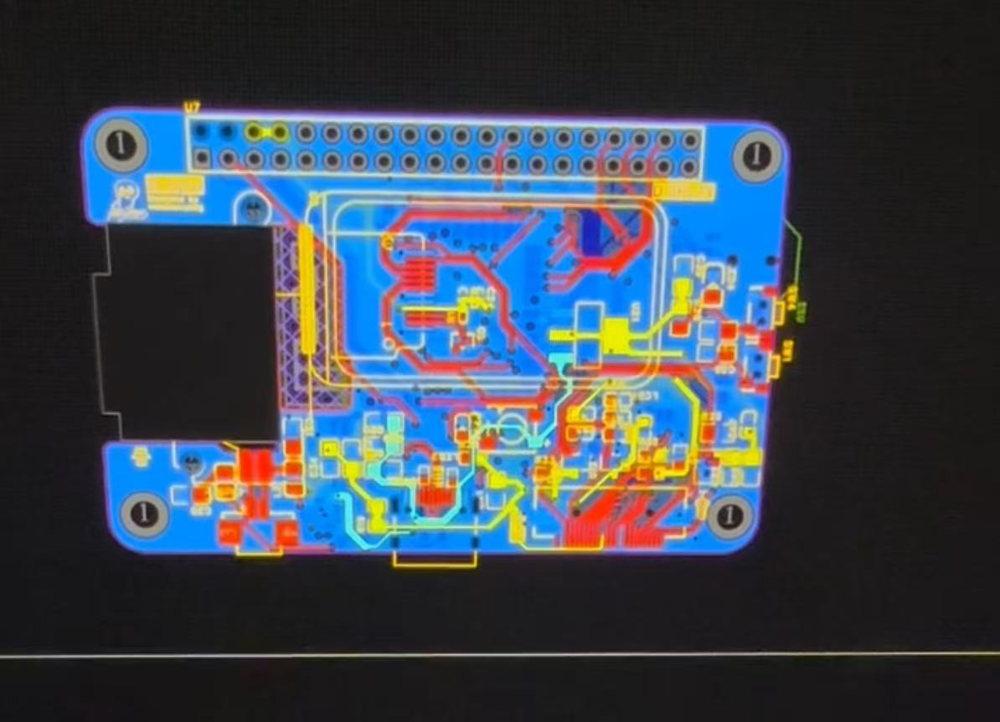
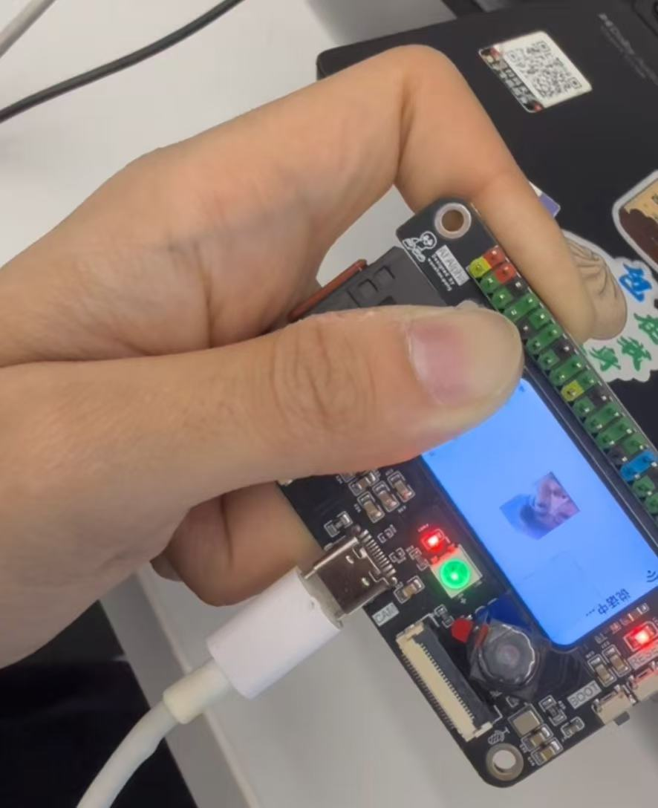

# One ESP32-S3 Full Pin Dev Board

ESP32-S3 全引脚引出 40Pin 开发板 —— 集成摄像头、波轮按键、SD 卡、屏幕、扬声器、麦克风、RGB LED，可适配 **小智 AI 直刷**。

---

## 概览

一块把 ESP32-S3 几乎所有可用 GPIO 都引到 40Pin 排针上的开发板，专为需要外设丰富、扩展灵活的场景设计。板载常用外设即插即用，也保留了完整接口供二次开发。

| 特性 | 描述 |
|------|------|
| **主控** | ESP32-S3，双核 Xtensa LX7 @ 240MHz |
| **引脚** | 全 GPIO 引出至 40Pin 2.54mm 排针 |
| **摄像头** | 板载摄像头接口（DVP） |
| **屏幕** | TFT 屏幕接口 |
| **存储** | MicroSD 卡槽 |
| **输入** | 波轮编码器 + 按键 |
| **音频** | 板载扬声器 + 麦克风 |
| **灯光** | RGB LED |
| **兼容** | 支持小智 AI 固件直刷 |

---

## 图片

| 板子整体（正面） | 板子整体（角度） |
|:---:|:---:|
|  |  |

| 布局细节 | 接口区域 |
|:---:|:---:|
|  |  |

| 焊接/成品 | 另一角度 |
|:---:|:---:|
|  |  |

---

## 文件

| 文件 | 说明 |
|------|------|
| `fusion_printable_top_cover.step` | 外壳上盖（3D 打印，STEP 格式） |
| `fusion_printable_bottom_case.step` | 外壳底壳（3D 打印，STEP 格式） |

## 板载资源

### 外设接口

- **摄像头接口** — DVP 并行接口，适配 OV2640 / OV7670 等常见摄像头模组
- **TFT 屏幕接口** — SPI/并行 LCD
- **MicroSD 卡槽** — SPI 模式，存储固件/数据/模型文件
- **波轮编码器** — 旋转编码器 + 按键开关，用于菜单/音量/参数调节
- **扬声器** — 小功率喇叭，I2S 音频 DAC 驱动
- **麦克风** — 板载 MEMS 麦克风，I2S 音频输入
- **RGB LED** — WS2812 / NeoPixel 可寻址彩灯
- **40Pin 排针** — 引出全部可用 GPIO，兼容标准洞洞板/面包板

### 引脚定义

#### 40Pin 排针引出

板子正面朝上，从左到右奇数排（1–39）在左侧，偶数排（2–40）在右侧。

| 左侧（奇数） | GPIO | 右侧（偶数） | GPIO |
|:---:|:---:|:---:|:---:|
| 1 | GPIO1 | 2 | GND |
| 3 | GPIO2 | 4 | GND |
| 5 | U0TXD | 6 | 3V3 |
| 7 | U0RXD | 8 | 3V3 |
| 9 | GPIO42 | 10 | GPIO4 |
| 11 | GPIO41 | 12 | GPIO5 |
| 13 | GPIO40 | 14 | GPIO6 |
| 15 | GPIO39 | 16 | GPIO7 |
| 17 | GPIO38 | 18 | GPIO15 |
| 19 | GPIO37 | 20 | GPIO16 |
| 21 | GPIO36 | 22 | GPIO17 |
| 23 | GPIO35 | 24 | GPIO18 |
| 25 | GPIO0 | 26 | GPIO8 |
| 27 | GPIO12 | 28 | GPIO9 |
| 29 | GPIO13 | 30 | GPIO20 |
| 31 | GPIO14 | 32 | GPIO3 |
| 33 | GPIO21 | 34 | GPIO46 |
| 35 | GPIO47 | 36 | GPIO9 |
| 37 | GPIO48 | 38 | GPIO10 |
| 39 | GPIO45 | 40 | GPIO11 |

#### 音频 I2S（Simplex 模式）

| 信号 | GPIO |
|------|------|
| 麦克风 WS | GPIO_NUM_1 |
| 麦克风 SCK | GPIO_NUM_2 |
| 麦克风 DIN | GPIO_NUM_42 |
| 扬声器 DOUT | GPIO_NUM_39 |
| 扬声器 BCLK | GPIO_NUM_40 |
| 扬声器 LRCK | GPIO_NUM_41 |

#### 摄像头 DVP

| 信号 | GPIO |
|------|------|
| D0–D7 | 11, 9, 8, 10, 12, 18, 17, 16 |
| XCLK | 15 |
| PCLK | 13 |
| VSYNC | 6 |
| HREF | 7 |
| SIOC (I2C SCL) | 5 |
| SIOD (I2C SDA) | 4 |
| PWDN / RESET | NC |

#### 屏幕 SPI

| 信号 | GPIO |
|------|------|
| 背光 | 38 |
| MOSI | 20 |
| CLK | 19 |
| DC | 47 |
| RST | 21 |
| CS | 45 |

#### MicroSD 卡（SPI 模式）

| 信号 | GPIO |
|------|------|
| MOSI | 35 |
| CLK | 36 |
| MISO | 37 |
| CS | NC（未连接，SD 卡通过硬件拉低常选通） |

#### 波轮编码器

| 信号 | GPIO |
|------|------|
| A 相 | 3 |
| B 相 | 14 |
| 按键开关 | 46 |

#### 其他

| 功能 | GPIO |
|------|------|
| RGB LED (WS2812) | 48 |
| BOOT 按键 | 0 |
| 灯控输出 (LAMP) | 14 |

> ⚠️ **注**：GPIO 14 同时用于波轮 B 相和灯控输出，需根据固件配置选择功能。
> 触摸按键、音量按键均未使用（GPIO_NUM_NC）。
> 当前屏幕默认配置为 **ST7789 170×320**，可根据需要切换 Kconfig 中的屏幕类型。

---

## 软件 / 固件

### 小智 AI 直刷

本开发板专为 **小智 AI**（XiaoZhi）固件设计，固件可直接刷入运行，无需额外硬件修改。

小智固件已默认适配板载所有外设：
- 摄像头画面采集
- 屏幕显示
- 音频输入输出（语音对话）
- 波轮按键交互
- RGB 状态灯效

### 通用 Arduino / ESP-IDF

板载外设驱动兼容 Arduino 和 ESP-IDF 框架，也可作为通用 ESP32-S3 开发板使用。

---

## 参考

- [ESP32-S3 数据手册](https://www.espressif.com/sites/default/files/documentation/esp32-s3_datasheet_en.pdf)
- [小智 AI 项目](https://github.com/78/xiaozhi-esp32)（待核实链接）

---

## 许可

本项目基于 [MIT License](LICENSE) 开源。

Copyright (c) 2026 Wanshan Pang
